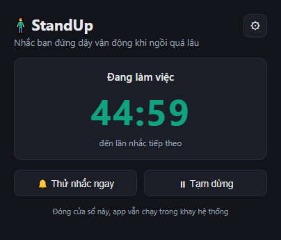

# 🧍 StandUp

App nhắc bạn đứng dậy khi ngồi máy quá lâu, và biết im khi bạn đang bận.

[](#cài-thế-nào)
[](LICENSE)
[](https://github.com/tarasami/StandUp/actions/workflows/test.yml)
[](#không-có-gì-chạy-ra-internet)

<p align="center">
  
</p>

Ai cũng biết ngồi liền 3 tiếng là hại lưng. Vấn đề là lúc đang tập trung thì không ai nhớ
cả. Đây không phải bài toán kiến thức, mà là bài toán thói quen.

Mình đã thử vài app cùng loại và gỡ hết. Không phải vì chúng chạy sai — mà vì chúng nhảy
ra giữa lúc họp, giữa lúc xem phim, hoặc nhắc ngay khi mình vừa đi ăn về ngồi xuống. Cái
khó của loại app này không nằm ở cái đồng hồ đếm ngược. Nó nằm ở chỗ nhắc sao cho đừng
phiền đến mức bị gỡ.

Nên StandUp được viết quanh đúng một nguyên tắc: **nhắc đúng lúc, và biết im khi cần** —
nhưng không bao giờ im vĩnh viễn.

## Nói trước cho khỏi mất thời gian

Mấy điều này nên biết trước khi bạn cuộn tiếp:

- **Chỉ chạy Windows 10/11.** Chưa có bản macOS hay Linux, và cũng chưa có kế hoạch.
- **Giao diện chỉ có tiếng Việt.** Tiếng Anh nằm trong danh sách việc phải làm, chưa làm.
- **Chưa có file cài sẵn.** Dự án đang ở đoạn cuối trước 1.0, bạn phải tự build. Nếu bạn
  không quen dòng lệnh thì cứ bấm Watch rồi quay lại sau, đừng mất công.
- **Viết bằng Electron**, nên nó không nhẹ như một app native. Mình chọn Electron vì máy
  chưa có Rust toolchain; chuyển sang Tauri là chuyện tính sau.

Nếu mấy điều trên không làm bạn nản thì đọc tiếp.

## Nó làm được gì

Cứ 45 phút (bạn tự đổi), một cửa sổ nhỏ hiện ra ở góc màn hình với ba lựa chọn: nghỉ ngay,
hoãn 5 phút, hoặc bỏ qua.

<table>
<tr>
<td width="50%" valign="top">

</td>
<td valign="top">

Cửa sổ này **không cướp focus**. Bạn đang gõ dở thì cứ gõ tiếp, không mất ký tự nào.

Nó cũng cố tình không dùng toast Windows. Lúc làm thì phát hiện toast có thể vào Action
Center mà banner không hiện — người dùng chẳng biết gì. Một cái nhắc có thể bị hệ thống
nuốt im lặng thì không đáng làm kênh chính.

Lời nhắc xoay vòng 12 câu khác nhau, dùng hết mới lặp. Đọc mãi một câu thì nó thành tiếng
ồn, mà tiếng ồn thì bị lờ đi.

</td>
</tr>
</table>

Bấm nghỉ thì màn hình bị che lại, kèm một động tác giãn cơ có hình chuyển động: xoay vai,
duỗi cổ, vươn người, gập lưng, giãn cổ tay, nghỉ mắt, đi vài bước, nhón chân. Tám bài xoay
vòng. Bấm `Esc` hoặc nút *Làm việc tiếp* là về ngay — che kín màn hình thì bắt buộc phải
luôn có lối ra.

Hình vẽ hết bằng SVG/CSS ngay trong code, không có file ảnh hay video nào. Mỗi hình vài KB.
Bật "giảm chuyển động" trong Windows thì hình đứng yên.

Không thích bị che màn hình thì tắt công tắc đi, giờ nghỉ quay về đếm ngược ở cửa sổ nhỏ.

### Chỗ khác biệt thật sự: nó biết lúc nào nên im

Đây là phần mình đổ nhiều công nhất, và cũng là lý do mấy app kia bị mình gỡ.

**Bạn rời máy thì nó biết.** Không chạm chuột phím quá 5 phút là nó tự tính bạn đã nghỉ
rồi, chu kỳ bắt đầu lại từ đầu. Đi ăn trưa về không bị nhắc ngay.

**Bạn đang toàn màn hình thì nó chờ.** Xem phim, chơi game, trình chiếu — nó hoãn tới khi
bạn xong. Chỗ này nó không đoán mò mà hỏi thẳng Windows bằng `SHQueryUserNotificationState`.
Nhưng nếu việc hỏi bị lỗi thì nó **vẫn nhắc**: thà nhắc nhầm lúc bạn đang bận, còn hơn tự
nhiên câm luôn mà bạn không hề hay biết.

**Nó không kẹt.** Nếu bạn bỏ mặc cửa sổ nhắc trên màn hình rồi đi mất, sau 3 phút nó tự
đóng và hoãn lại. Không có chuyện treo một cửa sổ chết rồi im mãi.

**Đếm bằng mốc thời gian tuyệt đối**, nên máy ngủ 3 tiếng rồi mở lại thì nó biết là đã 3
tiếng, chứ không phải mới trôi vài giây.

### Không có gì chạy ra Internet

Trong code không có một dòng nào kết nối mạng. Không phải kiểu "chúng tôi cam kết không gửi
dữ liệu" — mà là khả năng gửi không tồn tại. Bạn grep là thấy.

Mục `dependencies` cũng rỗng, chỉ Electron với electron-builder ở khâu phát triển. Không
thư viện UI, không framework, không file ảnh hay âm thanh đi kèm. Icon vẽ bằng code, tiếng
báo tổng hợp bằng Web Audio đúng hai nốt sine.

Không tài khoản, không đồng bộ, không đo đạc. Chi tiết: [SECURITY.md](SECURITY.md).

### Mấy thứ nhỏ

Tray icon hiện luôn số phút còn lại trên biểu tượng, đổi màu theo trạng thái: xanh là đang
làm việc, vàng là đang nhắc hoặc đang nghỉ, xám là bạn đi vắng hoặc đã tạm dừng.

Nhật ký sự kiện luôn bật. App chạy nền mà hiện hộp thoại lỗi giữa lúc bạn đang làm thì còn
tệ hơn chính cái lỗi — nên nó ghi vào file, lúc cần thì mở ra soi.

## Cài thế nào

Cần Windows 10 hoặc 11 bản 64-bit, và [Node.js](https://nodejs.org) từ phiên bản 20 trở lên.

Chưa có bản cài sẵn trên Releases, nên tự build:

```bash
git clone https://github.com/tarasami/StandUp.git
cd StandUp
npm install
npm run dist
```

Xong sẽ có `dist/StandUp-Setup-1.0.0.exe`. Trình cài cho chọn thư mục, tạo shortcut Desktop
và Start Menu, cài cho người dùng hiện tại nên không cần quyền admin.

Gỡ cài đặt không xoá cài đặt cá nhân trong `%APPDATA%\standup`. Cài lại là thấy nguyên
trạng.

Chỉ muốn chạy thử, không cần cài:

```bash
npm start
```

### Lần đầu chạy

<p align="center">
  
</p>

Chọn một con số, gạt hai công tắc, bấm Bắt đầu. App thu vào khay hệ thống và chạy luôn.
Không tài khoản, không hỏi gì thêm.

## Dùng hằng ngày

<table>
<tr>
<td width="42%" valign="top">

</td>
<td valign="top">

Một vòng chạy như sau: bạn làm việc, tray icon đếm ngược. Tới giờ thì cửa sổ nhắc hiện ra
kèm tiếng báo nhẹ. Bạn chọn nghỉ, hoãn, hay bỏ qua. Nếu nghỉ thì màn nghỉ hiện động tác
giãn cơ và đếm ngược. Hết giờ nghỉ, vòng mới bắt đầu.

Đóng cửa sổ chính chỉ là thu về khay, app vẫn chạy nền. Muốn tắt hẳn thì dùng menu tray.

</td>
</tr>
</table>

Chuột phải vào tray icon:

| Mục | Làm gì |
|---|---|
| Mở StandUp | Hiện cửa sổ chính |
| Nghỉ ngay | Vào giờ nghỉ luôn, không đợi hết chu kỳ |
| Thử nhắc nhở | Bắn thử một lời nhắc để xem nó trông thế nào |
| Tạm dừng 1 giờ | Im 1 tiếng rồi tự chạy lại |
| Tạm dừng (đến khi bật lại) | Im cho tới khi bạn bấm *Tiếp tục* |
| Tiếp tục | Chạy lại sau khi tạm dừng |
| Mở thư mục nhật ký | Mở `%APPDATA%\standup` trong Explorer |
| Thoát | Tắt hẳn |

Phím tắt duy nhất: `Esc` ở màn nghỉ để quay lại làm việc.

## Các ô cài đặt

Bấm nút ⚙ ở cửa sổ chính là phần cài đặt xổ ra.

<p align="center">
  
</p>

| Ô | Mặc định | Nhập được | Nghĩa là gì |
|---|---|---|---|
| Nhắc sau mỗi (phút) | 45 | 5–240 | Chu kỳ ngồi làm việc |
| Thời gian nghỉ (phút) | 5 | 1–60 | Giờ nghỉ dài bao lâu |
| Coi là rời máy sau (phút) | 5 | 1–60 | Không chạm chuột phím quá lâu thì coi như đã nghỉ |
| Vị trí cửa sổ nhắc | Dưới-phải | dưới-phải / giữa | Cửa sổ nhắc hiện ở đâu |
| Phát âm báo nhẹ khi nhắc | Bật | — | Hai nốt sine, không cần file nhạc |
| Khởi động cùng Windows | Bật | — | Chỉ ăn ở bản đã cài, không phải bản chạy từ mã nguồn |
| Tạm ẩn lời nhắc khi toàn màn hình | Bật | — | Hoãn nhắc lúc xem phim, chơi game, trình chiếu |
| Giờ nghỉ che màn hình kèm động tác | Bật | — | Tắt thì giờ nghỉ chỉ đếm ngược ở cửa sổ nhỏ |

Gõ số ngoài dải thì nó kẹp về biên, ví dụ 999 phút lưu thành 240. File cài đặt bị sửa tay
hỏng hay dính BOM thì app dùng mặc định chứ không chết.

## Dữ liệu của bạn nằm đâu

| Đường dẫn | Có gì trong đó |
|---|---|
| `%APPDATA%\standup\settings.json` | Cài đặt của bạn |
| `%APPDATA%\standup\standup.log` | Nhật ký, tự xoay vòng khi quá ~1MB sang `standup.log.1` |
| `%LOCALAPPDATA%\Programs\StandUp\` | Chỗ cài app |

Nhật ký ghi: khởi động, đổi cài đặt, chuyển trạng thái, máy ngủ/thức, bạn bấm gì, và mọi sự
cố ngoài dự tính. Nó **không** ghi tên cửa sổ, tên ứng dụng bạn đang mở, hay nội dung bạn gõ.

## Khi trục trặc

<details>
<summary><b>Không thấy icon ở khay hệ thống</b></summary>

Windows 10 mặc định giấu icon tray mới vào vùng tràn, sau nút `^`. Bấm `^` rồi kéo icon
StandUp ra thanh taskbar cho nó ở luôn ngoài. Màn hình onboarding cũng có nhắc chuyện này.
</details>

<details>
<summary><b>Bật "khởi động cùng Windows" mà chẳng thấy chạy</b></summary>

Công tắc này chỉ ăn ở bản đã cài. Bản chạy từ mã nguồn (`npm start`) bị bỏ qua có chủ ý:
nếu không, mục khởi động sẽ trỏ vào `electron.exe` nằm trong `node_modules`, mà bạn xoá thư
mục đó là để lại một mục khởi động chết trong registry.
</details>

<details>
<summary><b>App chẳng nhắc gì cả</b></summary>

Kiểm theo thứ tự này:

1. Tray icon có đang xám không? Xám nghĩa là đang tạm dừng, hoặc app nghĩ bạn đã rời máy.
2. Có đang xem phim hay chơi game toàn màn hình không? Công tắc *Tạm ẩn lời nhắc khi toàn
   màn hình* đang bật thì nó sẽ hoãn. Tắt đi nếu bạn muốn bị nhắc kể cả lúc đang cày.
3. Mở `%APPDATA%\standup\standup.log` (menu tray có sẵn lối tắt) rồi xem dòng cuối. Mỗi lần
   hoãn nó đều ghi rõ lý do.
</details>

<details>
<summary><b>Cài đặt của bản mã nguồn lẫn với bản đã cài</b></summary>

Đúng vậy, cả hai dùng chung `%APPDATA%\standup`, nên cũng chung khoá chống chạy trùng: mở
bản mã nguồn trong lúc bản đã cài đang chạy thì bản mới tự thoát ngay. Chỗ này từng làm
mình tưởng code sửa rồi mà không ăn. Muốn chạy tách biệt:

```bash
npx electron . --user-data-dir=.dev-profile
```
</details>

<details>
<summary><b>Toast báo hết giờ nghỉ hiện tên lạ chứ không phải "StandUp"</b></summary>

Windows cache danh tính ứng dụng trong database thông báo. Máy nào từng nhận toast từ app
này *trước khi* nó đăng ký AUMID thì tên cũ có thể còn kẹt lại. Máy cài mới không gặp.
Cơ chế đầy đủ: [docs/technical-notes.md](docs/technical-notes.md#toast-và-aumid).
</details>

## Nghịch code

```bash
npm install     # chỉ Electron + electron-builder
npm start       # chạy app từ mã nguồn
npm test        # 242 unit test, Node thuần, chưa tới 1 giây
npm run dist    # đóng gói installer NSIS vào dist/
npm run icon    # vẽ lại icon.ico (7 kích thước 16→256px) bằng code
```

Cấu trúc:

```
electron/
  engine.js       State machine THUẦN: toàn bộ logic, bộ câu nhắc, 8 động tác giãn cơ,
                  clampSettings. Không import Electron, nên unit-test được.
  main-utils.js   Hàm thuần tách khỏi main: parse cài đặt, tính kích thước và vị trí cửa
                  sổ, định dạng & xoay nhật ký, đọc trạng thái thông báo của Windows.
  main.js         Main process: tray, cửa sổ, powerMonitor, vòng tick 1 giây, nhật ký.
                  Chỉ THỰC THI effect mà engine trả về.
  preload.js      contextBridge — cầu IPC (contextIsolation bật, nodeIntegration tắt).
src/
  index.html      Cửa sổ chính: trạng thái + cài đặt (gọn, xổ ra khi bấm ⚙)
  onboarding.*    Màn hình lần chạy đầu
  reminder.*      Cửa sổ nhắc nổi (frameless, always-on-top, không cướp focus)
  overlay.*       Màn nghỉ + hình động giãn cơ (SVG/CSS)
  styles.css      Toàn bộ CSS, gồm @keyframes của 8 động tác
tools/
  make-icon.js    Sinh icon.ico nhiều kích thước, không dùng thư viện ngoài
test/
  engine.test.js       186 kiểm tra cho engine
  main-utils.test.js    56 kiểm tra cho hàm thuần tách khỏi main
docs/
  architecture.md      Kiến trúc: state machine, effect, IPC, vòng đời cửa sổ
  technical-notes.md   Những cái bẫy Windows/Electron đã gặp, kèm lý do
  testing.md           Chiến lược test, gồm cách nghiệm trên app chạy thật
```

Một quyết định định hình cả dự án: **toàn bộ logic nằm trong `engine.js`, và file đó không
được `require('electron')`**. Nó nhận `(now, idleSecs, canNotify)` rồi trả về danh sách
effect — `openReminder`, `openOverlay`, `sound`… — còn tầng Electron chỉ việc thi hành.

Nghe hơi cứng nhắc, nhưng đổi lại được ba thứ. Test chạy bằng Node thuần và **mô phỏng được
thời gian**: giả lập 8 tiếng làm việc trong vài mili giây, nên mấy ca như máy ngủ dậy hay
đồng hồ bị chỉnh lùi mới test nổi. Muốn đổi vỏ sang Tauri thì chỉ port phần thi hành effect.
Và thực tế thì **mọi lỗi thật của dự án này đều nằm ở tầng Electron, chưa lỗi nào ở
engine** — nên nguyên tắc là hàm nào tách khỏi Electron được thì tách sang `main-utils.js`
để có test.

Chi tiết: [docs/architecture.md](docs/architecture.md). Còn nếu bạn cũng đang viết app nền
cho Windows thì [docs/technical-notes.md](docs/technical-notes.md) là chỗ mình ghi lại từng
cái bẫy đã dẫm phải — chắc tiết kiệm cho bạn được vài buổi tối.

## Còn thiếu gì

Kế hoạch sản phẩm đầy đủ nằm trong [PLAN.md](PLAN.md). Tóm tắt tình hình:

Đủ 8/8 hạng mục MVP, cộng thêm mấy phần gia cố sau đó — nhật ký sự cố, tự hoãn lời nhắc bị
phớt lờ, nhường toàn màn hình, màn nghỉ kèm hình giãn cơ.

Trước khi dám gọi là 1.0 thì còn hai việc: thử trên một máy sạch chưa từng cài Node hay
Electron, và cho 5–10 người dùng thật xài rồi nghe họ chê.

Danh sách muốn làm sau đó:

- Lịch làm việc theo khung giờ và ngày trong tuần
- Thống kê ngày/tuần, tỉ lệ tuân thủ
- Nhận biết gọi video ở cửa sổ thường — Zoom hay Meet không chạy toàn màn hình thì Windows
  không báo bận, nên hiện giờ chịu
- Giao diện tiếng Anh
- Cân nhắc chuyển vỏ sang Tauri

Chỗ mình biết là còn mỏng: chưa test trên máy nhiều màn hình, và chưa test khi đổi tỉ lệ DPI
giữa chừng. Ai có màn hình phụ mà thử giúp thì quý lắm.

## Góp ý

Rất hoan nghênh. [CONTRIBUTING.md](CONTRIBUTING.md) có đủ cách dựng môi trường, quy ước
code và checklist trước khi mở pull request.

Lỗi và đề xuất thì [mở issue](https://github.com/tarasami/StandUp/issues). Muốn nói riêng
thì email <thaisami.hust@gmail.com>. Lỗi bảo mật thì đừng mở issue công khai, xem
[SECURITY.md](SECURITY.md).

## Giấy phép

[MIT](LICENSE). Dùng, sửa, mang đi đâu cũng được.

## English

StandUp is a Windows tray app that nags you to stand up after a configurable stretch of
sitting — 45 minutes by default — and shuts up when you are busy.

The hard part of an app like this is not the countdown. It is not being annoying enough to
get uninstalled. So: it detects when you have left the keyboard and quietly resets the
cycle; it asks Windows directly (`SHQueryUserNotificationState`) whether you are in a
full-screen video, a game or a presentation, and waits — but fails open, so a broken lookup
can never silence it forever. The reminder is a small floating window that never steals
focus, deliberately not a Windows toast, because toasts can be swallowed without a trace.

Take the break and the screen is covered by one of 8 stretches with an animated figure, all
drawn in SVG/CSS in code, no image or video assets. `Esc` gets you out.

Zero runtime dependencies, not a single line of networking code, no accounts, no telemetry.
Everything lives in `%APPDATA%\standup`. All business logic sits in a pure, Electron-free
state machine that returns effects for the Electron layer to execute — which is what makes
242 unit tests with simulated time possible.

Two honest caveats: **the interface is Vietnamese only** (English is on the list, not done),
and **there is no prebuilt installer yet** — you build it yourself with `npm install &&
npm run dist`, on Windows, with Node 20+. Licensed [MIT](LICENSE).
