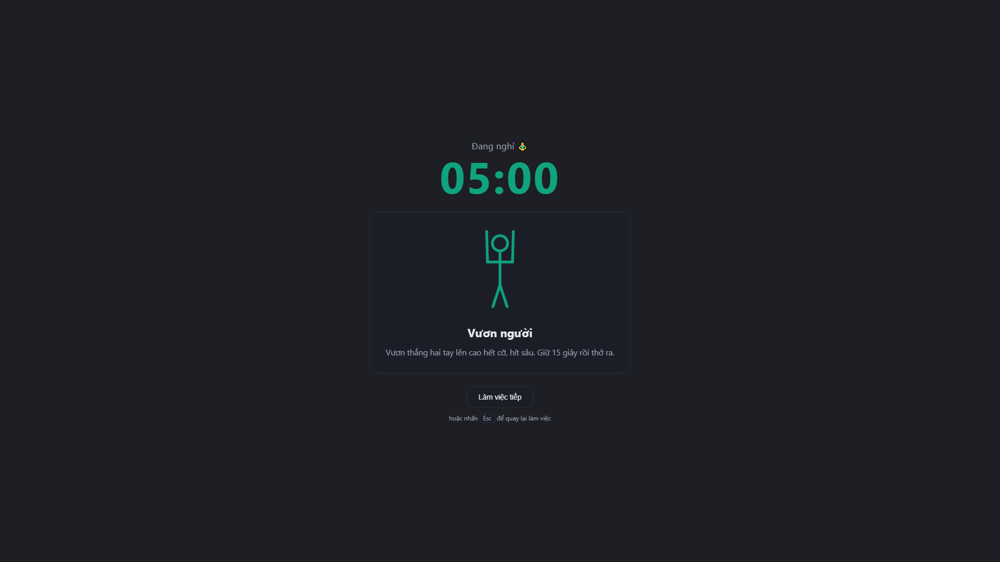
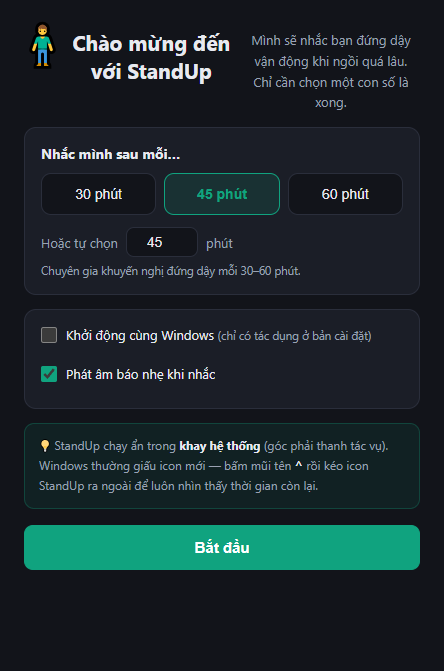
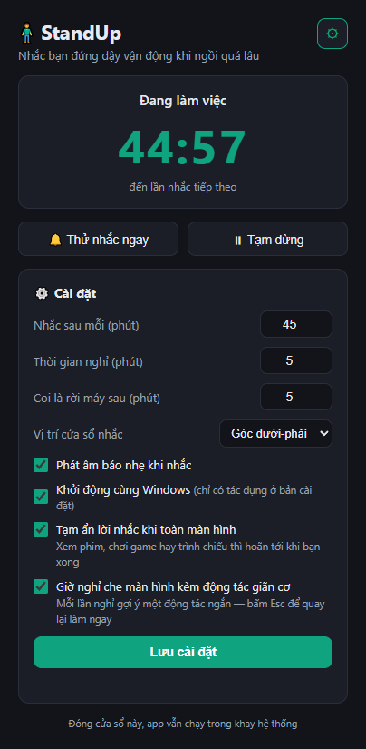

# 🧍 StandUp

**Nhắc bạn đứng dậy vận động khi ngồi máy quá lâu — và biết im lặng khi bạn đang bận.**

[](#cài-đặt)
[](LICENSE)
[](docs/kiem-thu.md)
[](#nhẹ--sạch)

<p align="center">
  
</p>

Ai cũng **biết** cần đứng dậy mỗi tiếng. Vấn đề là lúc đang tập trung thì **quên**. Phần khó
của một app như thế này không phải cái đồng hồ đếm giờ — mà là nhắc sao cho **không phiền
đến mức bị gỡ**. Mọi quyết định trong StandUp xoay quanh điều đó: *nhắc đúng lúc, đúng cách,
và biết im lặng khi cần.*

---

## Mục lục

- [Tính năng](#tính-năng)
- [Cài đặt](#cài-đặt)
- [Dùng thế nào](#dùng-thế-nào)
- [Bảng cài đặt](#bảng-cài-đặt)
- [Dữ liệu của bạn nằm ở đâu](#dữ-liệu-của-bạn-nằm-ở-đâu)
- [Khắc phục sự cố](#khắc-phục-sự-cố)
- [Phát triển](#phát-triển)
- [Lộ trình](#lộ-trình)
- [Đóng góp](#đóng-góp)
- [English summary](#english-summary)

---

## Tính năng

### Nhắc đúng lúc

- **Chu kỳ ngồi cấu hình được** (mặc định 45 phút), đếm bằng **timestamp tuyệt đối** nên
  sống sót qua sleep/hibernate — máy ngủ 3 tiếng rồi mở lại thì app biết là đã 3 tiếng.
- **Tự nhận biết bạn rời máy**: không chạm chuột/phím quá N phút (mặc định 5) là app coi
  như bạn đã nghỉ và tự bắt đầu chu kỳ mới. Đi ăn trưa về không bị nhắc ngay.
- **Nhường toàn màn hình**: đang xem phim, chơi game full-screen hay trình chiếu thì hoãn
  lời nhắc tới khi bạn xong. App **hỏi thẳng Windows** (`SHQueryUserNotificationState`)
  chứ không tự đoán, và *fail-open* — tra cứu lỗi thì vẫn nhắc, không bao giờ im vĩnh viễn.
- **Không kẹt**: lời nhắc bị phớt lờ quá 3 phút sẽ tự đóng và hoãn 5 phút, thay vì treo
  trên màn hình rồi im luôn.

### Nhắc đúng cách

<table>
<tr>
<td width="50%" valign="top">

</td>
<td valign="top">

**Cửa sổ nhắc nổi** ở góc màn hình (hoặc giữa, tuỳ bạn chọn), **không cướp focus** nên
không phá lúc bạn đang gõ. Ba lựa chọn rõ ràng: **Nghỉ ngay** · **Hoãn 5'** · **Bỏ qua**.

Đây là kênh nhắc **duy nhất** lúc tới giờ — cố tình không dùng toast Windows, vì toast dễ
bị hệ thống nuốt ngầm mà người dùng không hay biết.

**12 câu nhắc xoay vòng** (và 4 câu báo hết giờ nghỉ), dùng hết bộ mới lặp lại — đọc mãi
một câu thì thành tiếng ồn.

</td>
</tr>
</table>

### Giờ nghỉ có hướng dẫn

**Màn nghỉ che màn hình** kèm **một động tác giãn cơ có hình động** — 8 động tác xoay vòng
(xoay vai, duỗi cổ, vươn người, gập lưng, giãn cổ tay, nghỉ mắt, đi vài bước, nhón chân).

Toàn bộ hình được **vẽ bằng SVG/CSS ngay trong mã**, không một tệp ảnh hay video nào: mỗi
hình vài KB, chạy offline, sửa và dịch dễ. Bấm **Esc** hoặc nút **Làm việc tiếp** là quay
lại ngay — màn che kín màn hình thì luôn phải có lối thoát. Tôn trọng
`prefers-reduced-motion`: bật giảm chuyển động trong Windows thì hình đứng yên.

Không thích bị che màn hình? Tắt công tắc, giờ nghỉ quay về đếm ngược ở cửa sổ nhỏ.

### Nhẹ & sạch

- **0 phụ thuộc runtime** — `dependencies` rỗng; chỉ Electron và electron-builder ở khâu
  phát triển. Không thư viện UI, không framework, không tệp ảnh/âm thanh đi kèm.
- **Không có một dòng mã kết nối mạng.** Không tài khoản, không đồng bộ, không đo đạc từ
  xa, không quảng cáo. Chi tiết: [SECURITY.md](SECURITY.md).
- Icon và âm báo đều **sinh bằng code** (`tools/make-icon.js`, Web Audio 2 nốt sine).

### Những thứ nhỏ nhưng đáng kể

- **Tray icon hiện số phút còn lại ngay trên biểu tượng**, đổi màu theo trạng thái
  (xanh = đang làm việc, vàng = nhắc/nghỉ, xám = rời máy/tạm dừng).
- **Onboarding 30 giây** cho lần chạy đầu: chọn một con số là xong.
- **Nhật ký sự kiện luôn bật** — khi có trục trặc thì có cái mà soi, thay vì hộp thoại lỗi
  nhảy ra phá ngang một app chạy nền.

---

## Cài đặt

**Yêu cầu:** Windows 10 hoặc 11, 64-bit.

> **Chưa có bản phát hành sẵn.** Dự án đang ở giai đoạn trước 1.0 chính thức (còn thiếu
> thử nghiệm trên máy sạch và beta người dùng thật — xem [Lộ trình](#lộ-trình)). Hiện tại
> bạn tự build lấy; khi 1.0 sẵn sàng, bản cài sẽ được đăng ở mục **Releases**.

### Tự build bản cài đặt

Cần [Node.js](https://nodejs.org) ≥ 20.

```bash
git clone https://github.com/tarasami/StandUp.git
cd StandUp
npm install
npm run dist
```

Kết quả: `dist/StandUp-Setup-1.0.0.exe` — trình cài NSIS, cho chọn thư mục cài, tạo
shortcut Desktop + Start Menu. Cài cho **người dùng hiện tại**, không cần quyền quản trị.

Gỡ cài đặt **không** xoá cài đặt cá nhân trong `%APPDATA%\standup` — cài lại là thấy
nguyên trạng.

### Chạy thẳng từ mã nguồn (không cần build)

```bash
npm install
npm start
```

### Lần chạy đầu

<p align="center">
  
</p>

Chọn một con số, gạt hai công tắc, bấm **Bắt đầu** — app thu vào khay hệ thống và bắt đầu
đếm. Dưới 30 giây, không tài khoản, không hỏi gì thêm.

---

## Dùng thế nào

<table>
<tr>
<td width="42%" valign="top">

</td>
<td valign="top">

**Một chu kỳ diễn ra thế này:**

1. Bạn làm việc, tray icon đếm ngược.
2. Tới giờ → **cửa sổ nhắc** hiện ra góc màn hình kèm âm báo nhẹ.
3. Bạn chọn **Nghỉ ngay** (vào giờ nghỉ), **Hoãn 5'**, hoặc **Bỏ qua** (bắt đầu lại chu kỳ).
4. Trong giờ nghỉ, **màn nghỉ** hiện một động tác giãn cơ + đếm ngược.
5. Hết giờ nghỉ → tự động bắt đầu chu kỳ mới.

Đóng cửa sổ chính = **thu về khay hệ thống**, app vẫn chạy nền. Muốn thoát hẳn thì dùng
menu tray.

</td>
</tr>
</table>

### Menu khay hệ thống

Chuột phải vào tray icon:

| Mục | Tác dụng |
|---|---|
| **Mở StandUp** | Hiện cửa sổ chính |
| **Nghỉ ngay** | Vào giờ nghỉ luôn, không đợi hết chu kỳ |
| **Thử nhắc nhở** | Bắn thử một lời nhắc để xem nó trông thế nào |
| **Tạm dừng 1 giờ** | Im lặng 1 tiếng rồi tự chạy lại |
| **Tạm dừng (đến khi bật lại)** | Im lặng cho tới khi bạn bấm *Tiếp tục* |
| **Tiếp tục** | Chạy lại sau khi tạm dừng |
| **Mở thư mục nhật ký** | Mở `%APPDATA%\standup` trong Explorer |
| **Thoát** | Tắt hẳn app |

### Phím tắt

| Phím | Ở đâu | Tác dụng |
|---|---|---|
| `Esc` | Màn nghỉ | Quay lại làm việc ngay |

---

## Bảng cài đặt

Bấm nút **⚙** ở cửa sổ chính để xổ phần cài đặt.

<p align="center">
  
</p>

| Cài đặt | Mặc định | Dải hợp lệ | Ý nghĩa |
|---|---|---|---|
| Nhắc sau mỗi (phút) | 45 | 5–240 | Chu kỳ ngồi làm việc |
| Thời gian nghỉ (phút) | 5 | 1–60 | Độ dài giờ nghỉ |
| Coi là rời máy sau (phút) | 5 | 1–60 | Không chạm chuột/phím quá lâu → coi như đã nghỉ |
| Vị trí cửa sổ nhắc | Dưới-phải | dưới-phải / giữa màn hình | Chỗ cửa sổ nhắc hiện ra |
| Phát âm báo nhẹ khi nhắc | Bật | — | Hai nốt sine, không cần tệp nhạc |
| Khởi động cùng Windows | Bật | — | Chỉ có tác dụng ở bản đã cài, không phải bản chạy từ mã nguồn |
| Tạm ẩn lời nhắc khi toàn màn hình | Bật | — | Hoãn nhắc khi xem phim / chơi game / trình chiếu |
| Giờ nghỉ che màn hình kèm động tác | Bật | — | Tắt thì giờ nghỉ chỉ đếm ngược ở cửa sổ nhỏ |

Giá trị nhập ngoài dải sẽ được **kẹp về biên** (gõ 999 phút thì lưu thành 240), giá trị
hỏng rơi về mặc định — file cài đặt bị sửa tay hay hỏng cũng không làm app chết.

---

## Dữ liệu của bạn nằm ở đâu

| Đường dẫn | Nội dung |
|---|---|
| `%APPDATA%\standup\settings.json` | Cài đặt của bạn |
| `%APPDATA%\standup\standup.log` | Nhật ký sự kiện (tự xoay vòng ~1MB → `standup.log.1`) |
| `%LOCALAPPDATA%\Programs\StandUp\` | Nơi cài ứng dụng |

Nhật ký ghi: khởi động, đổi cài đặt, chuyển trạng thái, ngủ/thức máy, thao tác của bạn và
mọi sự cố ngoài dự tính. **Không** ghi tên cửa sổ, tiêu đề ứng dụng hay nội dung bạn gõ.

---

## Khắc phục sự cố

<details>
<summary><b>Không thấy icon ở khay hệ thống</b></summary>

Windows 10 **mặc định giấu icon tray mới** vào vùng tràn sau nút `^`. Bấm `^`, kéo icon
StandUp ra thanh taskbar để nó luôn hiện. (Onboarding cũng có hướng dẫn này.)
</details>

<details>
<summary><b>Bật "khởi động cùng Windows" mà không thấy chạy</b></summary>

Công tắc này **chỉ có tác dụng ở bản đã cài**. Bản chạy từ mã nguồn (`npm start`) sẽ bị bỏ
qua có chủ đích — nếu không, mục khởi động sẽ trỏ vào `electron.exe` trong `node_modules`,
xoá thư mục đó là để lại một mục khởi động chết trong registry.
</details>

<details>
<summary><b>App không nhắc gì cả</b></summary>

Kiểm tra theo thứ tự:

1. Tray icon có đang màu xám không? Xám = đang tạm dừng hoặc app nghĩ bạn đã rời máy.
2. Có đang xem phim/chơi game full-screen không? Công tắc *Tạm ẩn lời nhắc khi toàn màn
   hình* đang bật sẽ hoãn nhắc — tắt nó nếu bạn muốn được nhắc kể cả lúc đang cày.
3. Mở `%APPDATA%\standup\standup.log` (menu tray → *Mở thư mục nhật ký*) và xem dòng cuối.
   Nhật ký ghi rõ lý do mỗi lần hoãn.
</details>

<details>
<summary><b>Cài đặt của bản chạy từ mã nguồn lẫn với bản đã cài</b></summary>

Đúng vậy — cả hai dùng chung `%APPDATA%\standup`, nên cũng chung khoá chống chạy trùng:
mở bản mã nguồn trong khi bản đã cài đang chạy thì bản mới tự thoát. Muốn chạy tách biệt:

```bash
npx electron . --user-data-dir=.dev-profile
```
</details>

<details>
<summary><b>Toast báo hết giờ nghỉ hiện tên lạ thay vì "StandUp"</b></summary>

Windows cache danh tính ứng dụng trong database thông báo. Nếu máy bạn từng nhận toast từ
app này *trước khi* nó đăng ký AUMID, tên cũ có thể còn kẹt lại. Máy cài mới không gặp.
Chi tiết cơ chế: [docs/ghi-chu-ky-thuat.md](docs/ghi-chu-ky-thuat.md#toast-và-aumid).
</details>

---

## Phát triển

```bash
npm install     # cài phụ thuộc (chỉ Electron + electron-builder)
npm start       # chạy app từ mã nguồn
npm test        # 242 unit test, chạy bằng Node thuần — không cần Electron
npm run dist    # đóng gói installer NSIS vào dist/
npm run icon    # vẽ lại icon.ico (7 kích thước 16→256px) bằng code
```

### Cấu trúc mã

```
electron/
  engine.js       State machine THUẦN: mọi logic nghiệp vụ, bộ câu nhắc, 8 động tác
                  giãn cơ, clampSettings. Không import Electron → unit-test được.
  main-utils.js   Hàm thuần tách khỏi main: parse cài đặt, tính kích thước/vị trí cửa
                  sổ, định dạng & xoay nhật ký, đọc trạng thái thông báo của Windows.
  main.js         Main process: tray, cửa sổ, powerMonitor, vòng tick 1 giây, nhật ký.
                  Chỉ THỰC THI effect do engine trả về.
  preload.js      contextBridge — cầu IPC an toàn (contextIsolation bật, nodeIntegration tắt).
src/
  index.html      Cửa sổ chính: trạng thái + cài đặt (gọn, xổ ra khi bấm ⚙)
  onboarding.*    Màn hình lần chạy đầu
  reminder.*      Cửa sổ nhắc nổi (frameless, always-on-top, không cướp focus)
  overlay.*       Màn nghỉ + hình động giãn cơ (SVG/CSS)
  styles.css      Toàn bộ CSS, gồm các @keyframes của 8 động tác
tools/
  make-icon.js    Sinh icon.ico nhiều kích thước, không dùng thư viện ngoài
test/
  engine.test.js       186 kiểm tra — engine thuần
  main-utils.test.js    56 kiểm tra — hàm thuần tách khỏi main
docs/
  kien-truc.md         Kiến trúc: state machine, effect, IPC, vòng đời cửa sổ
  ghi-chu-ky-thuat.md  Những cái bẫy Windows/Electron đã gặp và cách xử lý
  kiem-thu.md          Chiến lược kiểm thử, gồm cách nghiệm trên app chạy thật
```

### Nguyên tắc kiến trúc

**Toàn bộ logic nghiệp vụ nằm trong `engine.js`** — một state machine thuần không phụ thuộc
Electron, nhận `(now, idleSecs, canNotify)` và trả về danh sách **effect** (`openReminder`,
`openOverlay`, `notify`, `sound`…). Tầng Electron chỉ việc thực thi effect.

Nhờ vậy:

- Logic test được bằng **mô phỏng thời gian** — chạy giả lập 3 tiếng trong vài mili giây.
- Đổi vỏ (Electron → Tauri) chỉ cần port phần thực thi effect, không đụng logic.
- Mọi lỗi thật gặp trong dự án này đều nằm ở **tầng Electron**, không phải engine — nên
  hàm nào tách ra khỏi Electron được thì chuyển sang `main-utils.js` để test.

Đọc sâu hơn: [docs/kien-truc.md](docs/kien-truc.md).

---

## Lộ trình

Kế hoạch sản phẩm đầy đủ (bối cảnh, phân tích cạnh tranh, personas): [PLAN.md](PLAN.md).

**Đã xong** — đủ 8/8 hạng mục MVP, cộng thêm phần gia cố sau MVP (nhật ký sự cố, tự hoãn
lời nhắc bị phớt lờ, nhường toàn màn hình, màn nghỉ + hình giãn cơ).

**Còn lại trước 1.0:**

- [ ] Thử trên máy sạch chưa từng cài Node/Electron
- [ ] Beta 5–10 người dùng thật

**Sau 1.0:**

- [ ] Lịch làm việc theo khung giờ và ngày trong tuần
- [ ] Thống kê ngày/tuần, tỉ lệ tuân thủ
- [ ] Phát hiện gọi video ở **cửa sổ** (Zoom/Meet không full-screen — Windows không báo bận)
- [ ] Song ngữ Việt–Anh trong giao diện
- [ ] Cân nhắc chuyển vỏ sang Tauri cho nhẹ hơn

---

## Đóng góp

Rất hoan nghênh. Xem [CONTRIBUTING.md](CONTRIBUTING.md) để biết cách dựng môi trường, quy
ước mã nguồn và những gì cần có trong một pull request.

Lỗi và đề xuất: [mở issue](https://github.com/tarasami/StandUp/issues).
Lỗi bảo mật: xem [SECURITY.md](SECURITY.md).

---

## Giấy phép

[MIT](LICENSE) — dùng, sửa, phân phối thoải mái.

---

## English summary

**StandUp** is a Windows tray app that reminds you to stand up and move after a
configurable sitting period (default 45 minutes) — and stays quiet when you are busy.

- **Smart quiet:** detects when you are away from the keyboard (auto-resets the cycle) and
  when Windows is busy (full-screen video, games, presentations) via
  `SHQueryUserNotificationState`, with fail-open behaviour.
- **Non-intrusive reminder:** a floating window that never steals focus, with
  *Break now* / *Snooze 5 min* / *Skip*. Deliberately not a Windows toast — those get
  swallowed silently.
- **Guided breaks:** a full-screen break overlay showing one of 8 stretches with an
  animated figure, all drawn in SVG/CSS in code — no image or video assets. `Esc` exits.
- **Light and clean:** zero runtime dependencies, no networking code at all, no accounts,
  no telemetry. Everything stays in `%APPDATA%\standup`.
- **Architecture:** all business logic lives in a pure, Electron-free state machine
  (`electron/engine.js`) that returns effects; the Electron layer only executes them. That
  is what makes 242 unit tests possible with simulated time.

The user interface and documentation are currently **Vietnamese only**; an English UI is on
the roadmap. Build it yourself with `npm install && npm run dist` (Node ≥ 20, Windows x64).
Licensed under [MIT](LICENSE).
